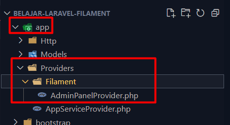
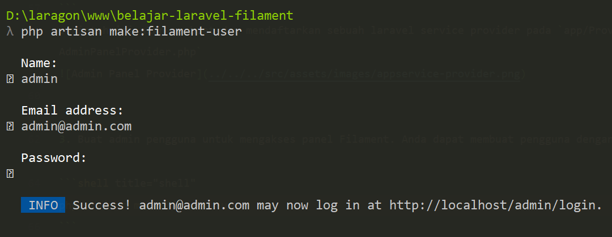

Laravel 11 dan Filament 3 menawarkan kombinasi yang kuat untuk pengembangan aplikasi web modern dan efisien. Dalam panduan ini, Anda akan mempelajari langkah-langkah untuk menginstal Laravel 11 dan mengintegrasikannya dengan Filament 3, sebuah framework administrasi yang tangguh dan fleksibel.

## Langkah 1: Persiapan Lingkungan

Sebelum memulai, pastikan Anda telah menginstal Composer dan PHP versi terbaru di sistem Anda. Laravel 11 memerlukan PHP versi 8.2 atau lebih baru.

## Langkah 2: Menginstal Laravel 11

1. Buka terminal Anda dan jalankan perintah berikut untuk membuat proyek Laravel baru:

```shell title="shell"
composer create-project --prefer-dist laravel/laravel:^11.0 belajar-laravel-filament
```

Perintah ini akan mengunduh dan mengatur instalasi dasar Laravel 11 dalam direktori `belajar-laravel-filament`. Untuk informasi lebih lanjut, Anda dapat mengunjungi [dokumentasi Laravel 11](https://laravel.com/docs/11.x).

2. Masuk ke direktori proyek Anda:

```shell title="shell"
cd belajar-laravel-filament
```

3. Jalankan server pengembangan Laravel:

```shell title="shell"
php artisan serve
```

Proyek Anda sekarang dapat diakses di `http://localhost:8000` atau kalau menggunakan valet/laragon bisa langsung akses http://belajar-laravel-filament.test.

## Langkah 3: Menginstal Filament 3

1. Untuk menginstal Filament, jalankan perintah berikut di dalam direktori proyek Laravel Anda:

```shell title="shell"
composer require filament/filament:"^3.2" -W
```

2. Setelah instalasi selesai, selanjutnya install panel admin:

```shell title="shell"
php artisan filament:install --panels
```

perintah ini akan membuat dan mendaftarkan sebuah laravel service provider pada `app/Providers/Filament/AdminPanelProvider.php`


3. Buat admin pengguna untuk mengakses panel Filament. Anda dapat membuat pengguna dengan Artisan:

```shell title="shell"
php artisan make:filament-user
```

Ikuti instruksi untuk menetapkan nama, email, dan kata sandi pengguna.


4. Sekarang, Anda dapat mengakses panel admin Filament di `http://localhost:8000/admin`.

Dengan langkah-langkah di atas, Anda telah berhasil menginstal Laravel 11 dan Filament 3. Anda sekarang dapat mulai membangun aplikasi web yang kuat dan efisien dengan memanfaatkan fitur-fitur canggih yang ditawarkan oleh kedua teknologi ini.

Selamat mencoba!
