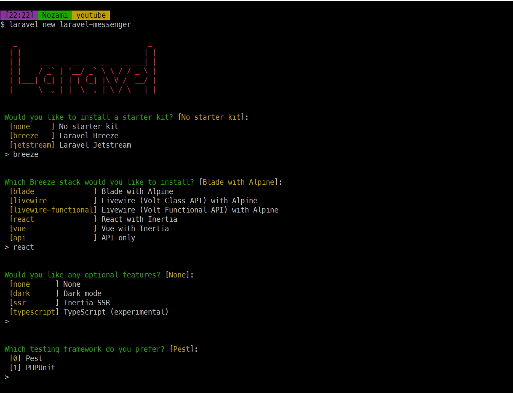

## Pendahuluan:

Dalam era digital yang berkembang pesat, kebutuhan akan aplikasi web yang dinamis dan efisien semakin meningkat. Laravel, sebagai salah satu framework PHP paling populer, terus memperbarui dirinya untuk memenuhi tuntutan industri. Dalam tutorial ini, kami akan membimbing Anda melalui langkah-langkah lengkap untuk membuat proyek Laravel Messenger dengan menggunakan Laravel 11.

## Persiapan Lingkungan:

Sebelum kita memulai, pastikan Anda sudah menginstall PHP 8.2 ke atas, composer, web engeine dan nodejs karena Laravel Messenger ini akan menggunakan Laravel 11 dan Reacjs serta database sqlite. Kalau saya sendiri menggunakan laragon yang sudah mencakup semua hal tersebut.

## nstalasi Laravel 11:

Untuk membuat project laravel saya menggunakan Laravel installer, jika anda belum menginstall bisa menginstall dengan perintah

```shell
composer global require laravel/installer
```

selanjutnya untuk membuat project tinggal menjalankan perintah.

```shell
laravel new laravel-messenger
```



starter kits saya menggunakan breeze dengan inertia react dan featurenya none. Untuk unit test dan databasenya saya menggunakan default nya yaitu pest dan sqlite. Untuk migrate database dan build asset sudah auto dilakukan saat install.

## Jalankan Aplikasi:

Selanjutnya, anda tinggal masuk ke folder project dan jalankan aplikasi. Jika anda menggunakan laragon project bisa langsung di akses di url [http://laravel-messgenre.test.](http://laravel-messgenre.test.)

```shell
cd laravel-messenger
php artisan serve
```

## Kesimpulan:

Dengan mengikuti langkah-langkah ini, Anda sekarang telah berhasil membuat proyek Laravel Messenger dengan menggunakan Laravel 11 dari awal. Jelajahi fitur-fitur canggih Laravel dan kembangkan aplikasi web yang dinamis dan efisien sesuai kebutuhan Anda.
