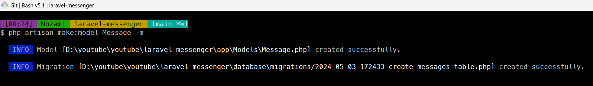

Selamat datang kembali ke seri tutorial Laravel Messenger! Pada bagian sebelumnya, kita telah membuat struktur dasar proyek kita dan mengatur database. Sekarang, kita akan melangkah lebih jauh dengan membuat model dan migration untuk entitas pesan.

## Langkah 1: Membuat Model dan Migration untuk Pesan

Pertama, mari buat model dan migration untuk pesan kita. Di dalam Laravel, model adalah representasi dari tabel database kita. Mereka memungkinkan kita untuk dengan mudah berinteraksi dengan data di dalam tabel tersebut.

Untuk membuat model dan migration, jalankan perintah artisan berikut di terminal:

```shell title="shell"
php artisan make:model Message -m
```

Perintah tersebut akan membuat 2 file yaitu model dan migration.

## Langkah 2: Menambahkan Field Pada File Migration

Selanjutnya edit file migration pada project saya bernama 2024_05_03_172433_create_messages_table.php menjadi seperti di bawah ini

```php title="xxxx_create_messages_table.php"
public function up(): void
{
    Schema::create('messages', function (Blueprint $table) {
        $table->id();
        $table->foreignId('sender_id')->constrained('users')->cascadeOnDelete();
        $table->foreignId('receiver_id')->constrained('users')->cascadeOnDelete();
        $table->foreignId('reply_id')->nullable(true)->constrained('messages')->cascadeOnDelete();
        $table->text('content');
        $table->timestamp('deleted_at')->nullable(true);
        $table->timestamp('seen_at')->nullable(true);
        $table->timestamps();
    });
}
```

## Langkah 3: Menambahkan Relasi dan Mass Assignment Pada Model Message

Buka file model Message.php dan tentukan properti untuk Mass Assignment dan relasi yang diperlukan.

```php title="app/models/Messages.php"
<?php

namespace App\Models;

use Illuminate\Database\Eloquent\Factories\HasFactory;
use Illuminate\Database\Eloquent\Model;
use Illuminate\Database\Eloquent\Relations\BelongsTo;

class Message extends Model
{
    use HasFactory;

    protected $fillable = [
        "sender_id", "receiver_id", "content"
    ];

    public function sender(): BelongsTo
    {
        return $this->belongsTo(User::class, 'sender_id', 'id');
    }

    public function receiver(): BelongsTo
    {
        return $this->belongsTo(User::class, 'receiver_id', 'id');
    }
}
```

## Langkah 4: Menambahkan Relasi Pada Model User

Buka file model User.php dan tbuat relasi yang diperlukan.

```php title="app/models/User.php"
<?php

namespace App\Models;

// use Illuminate\Contracts\Auth\MustVerifyEmail;
use Illuminate\Database\Eloquent\Factories\HasFactory;
use Illuminate\Foundation\Auth\User as Authenticatable;
use Illuminate\Notifications\Notifiable;
use Laravel\Sanctum\HasApiTokens;

class User extends Authenticatable
{
    use HasFactory, Notifiable, HasApiTokens;

    /**
     * The attributes that are mass assignable.
     *
     * @var array<int, string>
     */
    protected $fillable = [
        'name',
        'email',
        'password',
    ];

    /**
     * The attributes that should be hidden for serialization.
     *
     * @var array<int, string>
     */
    protected $hidden = [
        'password',
        'remember_token',
    ];

    /**
     * Get the attributes that should be cast.
     *
     * @return array<string, string>
     */
    protected function casts(): array
    {
        return [
            'email_verified_at' => 'datetime',
            'password' => 'hashed',
        ];
    }

    public function receiveMessages(): \Illuminate\Database\Eloquent\Relations\HasMany
    {
        return $this->hasMany(Message::class, 'receiver_id', 'id')->orderByDesc('id');
    }

    public function sendMessages(): \Illuminate\Database\Eloquent\Relations\HasMany
    {
        return $this->hasMany(Message::class, 'sender_id', 'id')->orderByDesc('id');
    }
}
```

## Langkah 5: Menjalankan Migrate

Langkah selanjutnya kita jalankan proses migrate database. Pada tutorial inis aya menggunakan database sqlite, jika anda ingin menggunakan mysql atau postgre tinggal diganti dibagian .env saja. Untuk menjalankan proses migrate cukun jalankah perintah

```shell title="shell"
php artisan migrate
```

## Kesimpulan

Dalam tutorial ini, kita telah belajar cara membuat model dan migration untuk entitas pesan dalam aplikasi Laravel Messenger kita. Sekarang, kita memiliki fondasi yang kuat untuk terus membangun fitur-fitur baru pada aplikasi kita.

Pada tutorial berikutnya, kita akan melihat cara menambahkan fungsionalitas untuk menampilkan pesan kepada pengguna. Jadi, tetaplah bersama kami!
