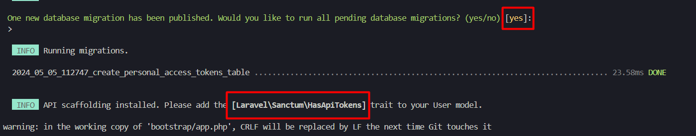
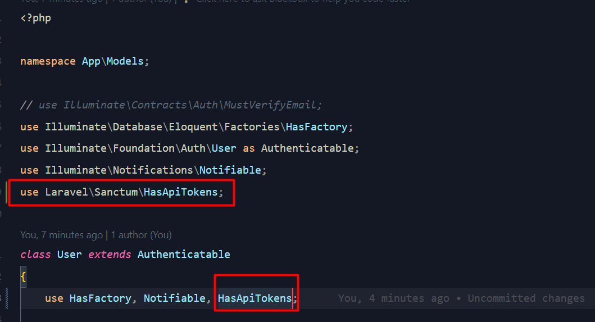

Dalam pengembangan aplikasi pesan, kemampuan untuk mencari pengguna menjadi krusial untuk memfasilitasi interaksi antar pengguna. Dengan menggunakan Laravel, Anda dapat dengan mudah membuat endpoint untuk pencarian pengguna. Dalam tutorial ini, kita akan melangkah melalui proses pembuatan endpoint tersebut.

## Pentingnya Endpoint Pencarian Pengguna

Dalam ekosistem aplikasi pesan, pencarian pengguna memainkan peran penting dalam memungkinkan pengguna menemukan dan berinteraksi dengan teman atau kontak baru. Dengan memiliki endpoint pencarian yang efektif, aplikasi Anda dapat memberikan pengalaman yang lebih baik kepada pengguna dengan menyediakan akses cepat dan mudah untuk menemukan orang-orang yang mereka cari.

## Langkah 1: Aktifkan Route API

Karena secara default laravel 11 tidak mengaktifkan route untuk api, maka langkah pertama adalah mengaktifkan route untuk api dengan cara

```shell
php artisan api:install
```

Maka sekarang akan terbuat file api.php pada folder routes. dan jangan lupa untuk menambahkan trait HasApiToken pada model User.



## Langkah 2: Membuat User Controller

Untuk logic pencarian User kita masukkan pada User Controller, pertama kita buat dulu User controllernya dengan perintah

```shell
php artisan make:controller UserController --test
```

Perintah ini akan membuat file `app\Http\Controllers\UserController.php `dan `tests\Feature\Http\Controllers\UserControllerTest.php`.Selanjutnya, Anda perlu membuat metode search di dalam UserController untuk menangani permintaan pencarian pengguna. Dalam metode ini, Anda akan menulis logika untuk melakukan pencarian pengguna berdasarkan kriteria yang diberikan.

```php
<?php

namespace App\Http\Controllers;

use App\Models\User;
use Illuminate\Http\Request;

class UserController extends Controller
{
    public function search(Request $request)
    {
        $query = $request->input('query');

        $users = User::where('name', 'like', "%$query%")->get();

        return response()->json(['users' => $users]);
    }
}

```

## Langkah 3: Menyiapkan Route

Langkah selanjutnya adalah menentukan rute atau route dalam aplikasi Laravel Anda untuk menangani permintaan pencarian pengguna. Anda dapat menambahkan rute ini di dalam file  routes/api.php.

```php
<?php

use App\Http\Controllers\UserController;
use Illuminate\Http\Request;
use Illuminate\Support\Facades\Route;

Route::get('/users/search', [UserController::class, 'search'])->name('users.search');

Route::get('/user', function (Request $request) {
    return $request->user();
})->middleware('auth:sanctum');

```

Rute ini akan mengarahkan permintaan GET ke endpoint /users/search ke dalam metode search di dalam UserController.

## Langkah 4: Membuat Unit Test

Sekarang edit file `tests\Feature\Http\Controllers\UserControllerTest.php` menjadi seperti berikut.

```php
<?php

use App\Models\User;
use Laravel\Pest\Factories\TestCase;

it('can search users', function () {
    $user1 = User::factory()->create(['name' => 'John Doe']);

    $response = $this->getJson('/api/users/search?query=John');
    $response->assertJsonCount(1, 'users')
        ->assertJson(['users' => [['name' => $user1->name]]]);
});

it('returns empty array when no users found', function () {
    $response = $this->getJson('/api/users/search?query=Nonexistent');

    $response->assertJsonCount(0, 'users')
        ->assertJson(['users' => []]);
});
```

kemudian jalankan unit test dengan cara

```shell
# windows
php artisan test tests/Feature/Http/Controllers/UserControllerTest.php
```

## Kesimpulan

Dalam tutorial ini, Anda telah mempelajari cara membuat endpoint pencarian pengguna dalam aplikasi Laravel Messenger Anda. Dengan memiliki endpoint ini, Anda memperluas fungsionalitas aplikasi Anda dan memberikan pengalaman yang lebih baik kepada pengguna dengan memberikan kemampuan untuk mencari dan menemukan teman atau kontak baru dengan mudah. Dengan langkah-langkah ini, Anda dapat mengintegrasikan fitur pencarian yang kuat ke dalam aplikasi pesan Anda.
