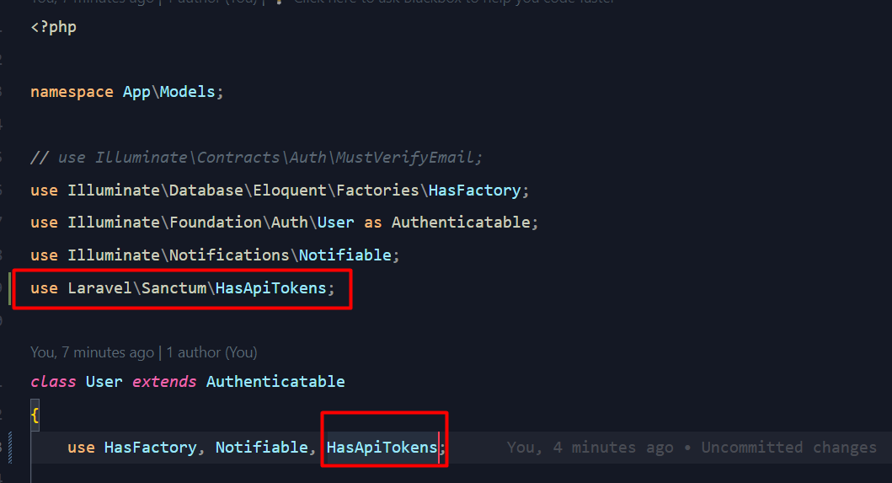

Dalam pengembangan aplikasi pesan, kemampuan untuk mencari pengguna menjadi krusial untuk memfasilitasi interaksi antar pengguna. Dengan menggunakan Laravel, Anda dapat dengan mudah membuat endpoint untuk pencarian pengguna. Dalam tutorial ini, kita akan melangkah melalui proses pembuatan endpoint tersebut.

## Pentingnya Endpoint Pencarian Pengguna

Dalam ekosistem aplikasi pesan, pencarian pengguna memainkan peran penting dalam memungkinkan pengguna menemukan dan berinteraksi dengan teman atau kontak baru. Dengan memiliki endpoint pencarian yang efektif, aplikasi Anda dapat memberikan pengalaman yang lebih baik kepada pengguna dengan menyediakan akses cepat dan mudah untuk menemukan orang-orang yang mereka cari.

## Langkah 1: Aktifkan Route API

Karena secara default laravel 11 tidak mengaktifkan route untuk api, maka langkah pertama adalah mengaktifkan route untuk api dengan cara

```shell title="shell"
php artisan install:api
```

Maka sekarang akan terbuat file api.php pada folder routes. dan jangan lupa untuk menambahkan trait HasApiToken pada model User.



## Langkah 2: Membuat User Controller

Untuk logic pencarian User kita masukkan pada User Controller, pertama kita buat dulu User controllernya dengan perintah

```shell title="shell"
php artisan make:controller UserController --test
```

Perintah ini akan membuat file `app\Http\Controllers\UserController.php `dan `tests\Feature\Http\Controllers\UserControllerTest.php`.Selanjutnya, Anda perlu membuat metode search di dalam UserController untuk menangani permintaan pencarian pengguna. Dalam metode ini, Anda akan menulis logika untuk melakukan pencarian pengguna berdasarkan kriteria yang diberikan.

```php title="php"
<?php

namespace App\Http\Controllers;

use App\Models\User;
use Illuminate\Http\Request;

class UserController extends Controller
{
    public function search(Request $request)
    {
        $query = $request->input('query');

        $users = User::where('name', 'like', "%$query%")->get();

        return response()->json(['users' => $users]);
    }
}

```

## Langkah 3: Menyiapkan Route

Langkah selanjutnya adalah menentukan rute atau route dalam aplikasi Laravel Anda untuk menangani permintaan pencarian pengguna. Anda dapat menambahkan rute ini di dalam file routes/api.php.

```php title="php"
<?php

use App\Http\Controllers\UserController;
use Illuminate\Http\Request;
use Illuminate\Support\Facades\Route;

Route::get('/users/search', [UserController::class, 'search'])->name('users.search');

Route::get('/user', function (Request $request) {
    return $request->user();
})->middleware('auth:sanctum');

```

Rute ini akan mengarahkan permintaan GET ke endpoint /users/search ke dalam metode search di dalam UserController.

## Langkah 4: Membuat Unit Test

Sekarang edit file `tests\Feature\Http\Controllers\UserControllerTest.php` menjadi seperti berikut.

```php title="php"
<?php

use App\Models\User;
use Database\Seeders\DatabaseSeeder;
use Laravel\Pest\Factories\TestCase;

it('can search users', function () {
    $this->seed(DatabaseSeeder::class);
    $user1 = User::factory()->create(['name' => 'John Doe']);

    $response = $this
                ->actingAs($user1)
                ->getJson('/api/users/search?query=test');
                info($response->json());
    $response->assertJsonCount(1, 'users')
        ->assertJson(['users' => [['name' => 'Test User']]]);
    $response->assertStatus(200);
});

it('return empty array when no user found', function () {
    $this->seed(DatabaseSeeder::class);
    $user1 = User::factory()->create(['name' => 'John Doe']);

    $response = $this
                ->actingAs($user1)
                ->getJson('/api/users/search?query=tidak ada');
    $response->assertJsonCount(0, 'users')
        ->assertJson(['users' => []]);
    $response->assertStatus(200);
});

```

kemudian jalankan unit test dengan cara

```shell title="shell"
php artisan test --filter UserControllerTest
```

## Langkah 5: Adjust SearchChatBar Component

Selanjutnya kita adjust resources\js\Components\SearchChatBar.jsx agar menampilkan hasil dari search kita.

```javascript title="javascript"
import React, { Fragment, useCallback, useEffect, useState } from 'react'
import { Combobox, Dialog, Transition } from '@headlessui/react'
import { MagnifyingGlassIcon, UserCircleIcon } from '@heroicons/react/24/outline/index.js'
import clsx from 'clsx'
import { Link } from '@inertiajs/react'
import axios from 'axios'
import { debounce } from 'lodash'

export default function SearchChatBar() {
	const [query, setQuery] = useState('')
	const [open, setOpen] = useState(false)
	const [users, setUsers] = useState([])
	const [loading, setLoading] = useState(false)

	const searchUser = useCallback(
		debounce(async (query) => {
			await axios('/api/users/search', {
				method: 'GET',
				params: {
					query: query
				}
			}).then((res) => {
				setUsers(res?.data?.users)
				setLoading(false)
			})
		}, 500),
		[]
	)

	useEffect(() => {
		if (query !== '') {
			setLoading(true)
			searchUser(query)
		}
	}, [query])

	return (
		<>
			<div className='px-2.5'>
				<label htmlFor='search' className='sr-only'>
					Search or start a new chat
				</label>
				<div className='relative mt-1 rounded-md shadow-sm'>
					<div
						className='absolute inset-y-0 left-0 flex items-center pl-3 pointer-events-none'
						aria-hidden='true'
					>
						<svg
							className='w-3 h-3 mr-3 text-gray-400'
							xmlns='http://www.w3.org/2000/svg'
							viewBox='0 0 20 20'
							fill='currentColor'
							aria-hidden='true'
						>
							<path
								fillRule='evenodd'
								d='M8 4a4 4 0 100 8 4 4 0 000-8zM2 8a6 6 0 1110.89 3.476l4.817 4.817a1 1 0 01-1.414 1.414l-4.816-4.816A6 6 0 012 8z'
								clipRule='evenodd'
							/>
						</svg>
					</div>
					<button
						type='button'
						onClick={() => setOpen(true)}
						className='block w-full h-full px-4 py-2 text-xs text-gray-400 bg-gray-800 border border-gray-700 rounded-md focus:ring-gray-700 focus:border-gray-700 pl-9'
					>
						Search or start a new chat
					</button>
				</div>
			</div>
			<Transition.Root show={open} as={Fragment} afterLeave={() => setQuery('')}>
				<Dialog
					as='div'
					className='fixed inset-0 z-10 p-4 overflow-y-auto sm:p-6 md:p-20'
					onClose={setOpen}
				>
					<Transition.Child
						as={Fragment}
						enter='ease-out duration-300'
						enterFrom='opacity-0'
						enterTo='opacity-100'
						leave='ease-in duration-200'
						leaveFrom='opacity-100'
						leaveTo='opacity-0'
					>
						<Dialog.Overlay className='fixed inset-0 transition-opacity bg-gray-500 bg-opacity-25' />
					</Transition.Child>

					<Transition.Child
						as={Fragment}
						enter='ease-out duration-300'
						enterFrom='opacity-0 scale-95'
						enterTo='opacity-100 scale-100'
						leave='ease-in duration-200'
						leaveFrom='opacity-100 scale-100'
						leaveTo='opacity-0 scale-95'
					>
						<Combobox
							as='div'
							className='max-w-2xl mx-auto overflow-hidden transition-all transform bg-white divide-y divide-gray-500 shadow-2xl divide-opacity-10 rounded-xl bg-opacity-80 ring-1 ring-black ring-opacity-5 backdrop-blur backdrop-filter'
						>
							<div className='relative'>
								{loading ? (
									<div
										className='absolute inset-y-0 flex items-center pl-3 pointer-events-none left-1'
										aria-hidden='true'
									>
										<svg
											className='w-5 h-5 text-gray-400 animate-spin'
											xmlns='http://www.w3.org/2000/svg'
											fill='none'
											viewBox='0 0 24 24'
										>
											<circle
												className='opacity-25'
												cx={12}
												cy={12}
												r={10}
												stroke='currentColor'
												strokeWidth={4}
											/>
											<path
												className='opacity-75'
												fill='currentColor'
												d='M4 12a8 8 0 018-8V0C5.373 0 0 5.373 0 12h4zm2 5.291A7.962 7.962 0 014 12H0c0 3.042 1.135 5.824 3 7.938l3-2.647z'
											/>
										</svg>
									</div>
								) : (
									<MagnifyingGlassIcon
										className='pointer-events-none absolute top-3.5 left-4 h-5 w-5 text-gray-900 text-opacity-40'
										aria-hidden='true'
									/>
								)}
								<Combobox.Input
									className='w-full h-12 pr-4 text-gray-900 placeholder-gray-500 bg-transparent border-0 pl-11 focus:ring-0 sm:text-sm'
									placeholder='Search or start a new chat ...'
									autoComplete={'off'}
									onChange={(event) => setQuery(event.target.value)}
								/>
							</div>

							{(query === '' || users.length > 0) && (
								<Combobox.Options
									static
									className='overflow-y-auto divide-y divide-gray-500 max-h-80 scroll-py-2 divide-opacity-10'
								>
									<li className='p-0'>
										<ul className='text-sm text-gray-700'>
											{users.map((user) => (
												<Combobox.Option
													key={user.id}
													value={user}
													className={({ active }) =>
														clsx(
															'flex cursor-default select-none items-center rounded-md px-3 py-2',
															active && 'bg-gray-900 bg-opacity-5 text-gray-900'
														)
													}
												>
													{({ active }) => (
														<>
															<UserCircleIcon
																className={clsx(
																	'h-6 w-6 flex-none text-gray-900 text-opacity-40',
																	active && 'text-opacity-100'
																)}
																aria-hidden='true'
															/>
															<Link
																onClick={() => {
																	setQuery('')
																	setUsers([])
																	setOpen(false)
																}}
																href={route('chat.show', user.id)}
																className='flex-auto ml-3 truncate'
															>
																{user.name}
															</Link>
														</>
													)}
												</Combobox.Option>
											))}
										</ul>
									</li>
								</Combobox.Options>
							)}

							{query !== '' && users.length === 0 && !loading && (
								<div className='px-6 text-center py-14 sm:px-14'>
									<UserCircleIcon
										className='w-6 h-6 mx-auto text-gray-900 text-opacity-40'
										aria-hidden='true'
									/>
									<p className='mt-4 text-sm text-gray-900'>
										We couldn't find any users matching &quot;{query}&quot;
									</p>
								</div>
							)}
						</Combobox>
					</Transition.Child>
				</Dialog>
			</Transition.Root>
		</>
	)
}
```

## Langkah 6: Adjust ChatListUser Component

Selanjutnya kita adjust resources\js\Components\ChatListUser.jsx agar menampilkan user yang ada history chat saja.

```javascript title="javascript"
//resources\js\Components\ChatListUser.jsx

import React from 'react'
import { Link, usePage } from '@inertiajs/react'
import ProfilePictureOnChat from '@/Components/ProfilePictureOnChat.jsx'
import clsx from 'clsx'

export default function ChatListUser() {
	const { chat_with: chatWithUser, auth } = usePage().props
	const { users } = usePage().props

	return (
		<>
			<div className='flex-1 mt-3 overflow-y-auto' scroll-region='true'>
				{users.map((user) => {
					let chat = null
					const receiveMessage = user?.receive_message?.length > 0 && user?.receive_message[0]
					const sendMessage = user?.send_message?.length > 0 && user?.send_message[0]
					console.log('user', user)

					if (receiveMessage && sendMessage)
						chat = receiveMessage?.id > sendMessage?.id ? receiveMessage : sendMessage
					else if (receiveMessage) chat = receiveMessage
					else if (sendMessage) chat = sendMessage

					return (
						<Link
							preserveScroll
							key={user.id}
							href={route('chat.show', user)}
							className={clsx(
								user.id === chatWithUser?.id ? 'bg-gray-800' : 'bg-transparent',
								'flex w-full items-center hover:bg-gray-800/60 px-2.5 py-3 rounded-md'
							)}
						>
							<div className='items-center mr-3 flex-2'>
								<ProfilePictureOnChat user={user} />
							</div>
							<div className='flex flex-col flex-1 min-w-0 pr-2'>
								<div className='flex items-center justify-between'>
									<div className='text-gray-100 text-sm font-medium truncate mb-1.5'>
										{user.name}
									</div>
									<div className='text-[10px] text-gray-400 mb-1'>{chat?.sent_at}</div>
								</div>
								<div className='flex items-center justify-between'>
									<div className='flex items-center text-xs text-gray-400'>
										<div>
											{chat?.sender_id === auth.user.id && !chat?.message_deleted_at && (
												<svg
													xmlns='http://www.w3.org/2000/svg'
													width='24'
													height='24'
													fill='currentColor'
													viewBox='0 0 24 24'
													id='double-check'
													className={clsx(
														chat?.seen_at ? 'text-cyan-500' : 'text-gray-400/80',
														'w-4 h-4 mr-1'
													)}
												>
													<path
														fillRule='evenodd'
														d='M16.5303 6.46967C16.8232 6.76256 16.8232 7.23744 16.5303 7.53033L6.53033 17.5303C6.38968 17.671 6.19891 17.75 6 17.75 5.80109 17.75 5.61032 17.671 5.46967 17.5303L1.46967 13.5303C1.17678 13.2374 1.17678 12.7626 1.46967 12.4697 1.76256 12.1768 2.23744 12.1768 2.53033 12.4697L6 15.9393 15.4697 6.46967C15.7626 6.17678 16.2374 6.17678 16.5303 6.46967zM22.5303 6.46966C22.8232 6.76254 22.8232 7.23742 22.5303 7.53032L12.5308 17.5303C12.2379 17.8232 11.7631 17.8232 11.4702 17.5304L9.96975 16.0304C9.67681 15.7376 9.67674 15.2627 9.96959 14.9697 10.2624 14.6768 10.7373 14.6767 11.0303 14.9696L12.0004 15.9394 21.4697 6.46968C21.7625 6.17678 22.2374 6.17677 22.5303 6.46966z'
														clipRule='evenodd'
													></path>
												</svg>
											)}
										</div>
										{chat?.message_deleted_at ? (
											<span className='mr-2 italic text-gray-500'>{chat?.message}</span>
										) : (
											<div
												className='overflow-hidden break-all'
												style={{
													display: '-webkit-box',
													WebkitLineClamp: 1,
													WebkitBoxOrient: 'vertical'
												}}
											>
												{chat?.message}
											</div>
										)}
									</div>
									{user.send_message_count > 0 && (
										<div className='inline-flex items-center px-1.5 rounded-full text-[10px] bg-purple-500 text-white'>
											{user.send_message_count}
										</div>
									)}
								</div>
							</div>
						</Link>
					)
				})}
			</div>
		</>
	)
}
```

## Langkah 7: Adjust MessageController

terakhir kita sesuaikan MessageController kita

```php title="php"
<?php

namespace App\Http\Controllers;

use App\Events\MessageSent;
use App\Models\Message;
use App\Models\User;
use Illuminate\Http\Request;
use Inertia\Response;

class MessageController extends Controller
{
    public function index(): Response
    {
        return inertia('Chat/Index', [
            "users" => $this->getUser()
        ]);
    }

    public function show(User $user): Response
    {
        return inertia('Chat/Show', [
            "chat_with" => $user,
            "messages" => Message::query()
                ->where(fn ($q) => $q->where('sender_id', auth()->user()->id)->where('receiver_id', $user->id))
                ->orWhere(fn ($q) => $q->where('sender_id', $user->id)->where('receiver_id', auth()->user()->id))
                ->get()
                ->groupBy(function ($message) {
                    return $message->created_at->isToday() ? "Today" : ($message->created_at->isYesterday() ? "Yesterday" : $message->created_at->format("F j, Y"));
                })
                ->map(function ($messages, $date) {
                    return [
                        "messages" => $messages,
                        "date" => $date
                    ];
                })
                ->values(),
            "users" => $this->getUser()
        ]);
    }

    public function store(User $user, Request $request)
    {
        /** @var User $authUser */
        $authUser = auth()->user();
        $authUser->sendMessage()->create([
            "content" => $request->message,
            "receiver_id" => $user->id,
        ]);

        broadcast(new MessageSent($request->message))->toOthers();

        return back();
    }

    public function destroy(Message $message)
    {
        if ($message->sender_id !== auth()->id()) {
            abort(403);
        }

        tap($message)->update([
            'deleted_at' => now(),
        ]);

        return back();
    }

    private function getUser()
    {
        return User::query()
                ->whereHas('sendMessage', function($query){
                    $query->where('receiver_id', auth()->user()->id);
                })
                ->orWhereHas('receiveMessage', function($query){
                    $query->where('sender_id', auth()->user()->id);
                })
                ->withCount(['sendMessage' => fn($query) => $query->where('receiver_id', auth()->id())->whereNull('seen_at')])
                ->with([
                    'sendMessage' => function ($query) {
                        $query->whereIn('id', function ($query) {
                            $query->selectRaw('max(id)')
                                ->from('messages')
                                ->where('receiver_id', auth()->id())
                                ->groupBy('sender_id');
                        });
                    },
                    'receiveMessage' => function ($query) {
                        $query->whereIn('id', function ($query) {
                            $query->selectRaw('max(id)')
                                ->from('messages')
                                ->where('sender_id', auth()->id())
                                ->groupBy('receiver_id');
                        });
                    },
                ])
                ->orderByDesc(function ($query) {
                    $query->select('created_at')
                        ->from('messages')
                        ->whereColumn('sender_id', 'users.id')
                        ->orWhereColumn('receiver_id', 'users.id')
                        ->orderByDesc('created_at')
                        ->limit(1);
                })
                ->get();
    }
}

```

## Kesimpulan

Dalam tutorial ini, Anda telah mempelajari cara membuat endpoint pencarian pengguna dalam aplikasi Laravel Messenger Anda. Dengan memiliki endpoint ini, Anda memperluas fungsionalitas aplikasi Anda dan memberikan pengalaman yang lebih baik kepada pengguna dengan memberikan kemampuan untuk mencari dan menemukan teman atau kontak baru dengan mudah. Dengan langkah-langkah ini, Anda dapat mengintegrasikan fitur pencarian yang kuat ke dalam aplikasi pesan Anda.
